# Patrones de Diseño GoF

## Introducción

Los patrones de diseño GoF (Gang of Four) son soluciones reutilizables para problemas comunes en el desarrollo de software orientado a objetos.

Los patrones se clasifican en tres categorías:

* Creacionales
* Estructurales
* De Comportamiento

---

# Tabla General de los 23 Patrones GoF

| Nombre Patrón           | Categoría      | Problema que Resuelve                         | Casos de Uso                  |
| ----------------------- | -------------- | --------------------------------------------- | ----------------------------- |
| Singleton               | Creacional     | Garantizar una única instancia                | Conexión a BD                 |
| Factory Method          | Creacional     | Crear objetos sin conocer la clase exacta     | Interfaces gráficas           |
| Abstract Factory        | Creacional     | Crear familias de objetos relacionados        | Sistemas multiplataforma      |
| Builder                 | Creacional     | Construcción paso a paso de objetos complejos | Generadores de documentos     |
| Prototype               | Creacional     | Clonar objetos existentes                     | Copias de configuraciones     |
| Adapter                 | Estructural    | Compatibilizar interfaces diferentes          | Integración de librerías      |
| Bridge                  | Estructural    | Separar abstracción de implementación         | Interfaces y motores gráficos |
| Composite               | Estructural    | Tratar objetos simples y compuestos igual     | Árboles y menús               |
| Decorator               | Estructural    | Agregar funcionalidades dinámicamente         | Streams en Java               |
| Facade                  | Estructural    | Simplificar acceso a subsistemas              | APIs complejas                |
| Flyweight               | Estructural    | Optimizar memoria compartiendo objetos        | Juegos y editores             |
| Proxy                   | Estructural    | Controlar acceso a otro objeto                | Seguridad y caché             |
| Chain of Responsibility | Comportamiento | Pasar solicitudes en cadena                   | Middleware                    |
| Command                 | Comportamiento | Encapsular solicitudes                        | Sistemas undo/redo            |
| Interpreter             | Comportamiento | Interpretar lenguaje o expresiones            | Compiladores                  |
| Iterator                | Comportamiento | Recorrer colecciones                          | Listas y arrays               |
| Mediator                | Comportamiento | Centralizar comunicación                      | Chats y GUI                   |
| Memento                 | Comportamiento | Guardar/restaurar estados                     | Undo en editores              |
| Observer                | Comportamiento | Notificar cambios automáticamente             | Eventos                       |
| State                   | Comportamiento | Cambiar comportamiento según estado           | Máquinas de estado            |
| Strategy                | Comportamiento | Intercambiar algoritmos                       | Métodos de pago               |
| Template Method         | Comportamiento | Definir estructura de algoritmo               | Frameworks                    |
| Visitor                 | Comportamiento | Agregar operaciones sin modificar clases      | Compiladores                  |

---

# Desarrollo de los Patrones GoF

---

# 1. Singleton

## Categoría

Creacional

## Problema que resuelve

Garantiza que una clase tenga una única instancia y proporciona un punto de acceso global.

## Diagrama de clases

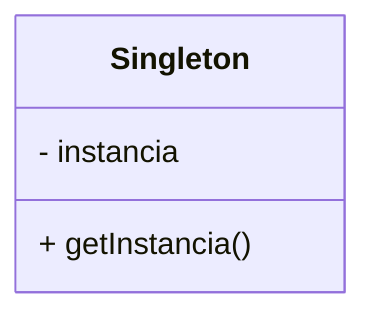

## Casos de uso

* Conexiones a base de datos
* Configuración global
* Logs del sistema

## Ventajas

* Control de instancia única
* Ahorro de memoria
* Acceso global

## Desventajas

* Puede generar alto acoplamiento
* Difícil de probar

## Patrones relacionados

* Factory Method
* Abstract Factory

---

# 2. Factory Method

## Categoría

Creacional

## Problema que resuelve

Permite crear objetos sin especificar la clase exacta.

## Diagrama de clases

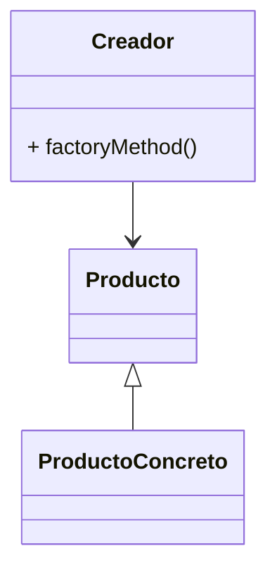

## Casos de uso

* Frameworks
* Interfaces gráficas
* Sistemas extensibles

## Ventajas

* Reduce acoplamiento
* Facilita extensibilidad

## Desventajas

* Aumenta número de clases

## Patrones relacionados

* Abstract Factory
* Prototype

---

# 3. Abstract Factory

## Categoría

Creacional

## Problema que resuelve

Permite crear familias de objetos relacionados.

## Diagrama de clases

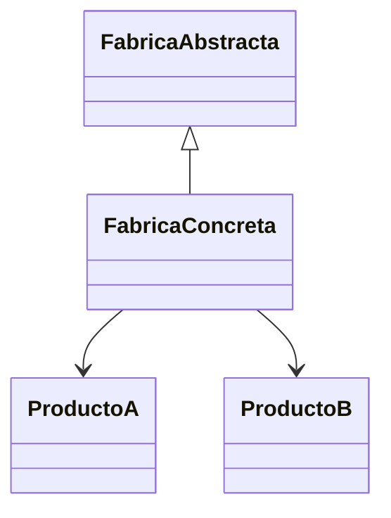

## Casos de uso

* Sistemas multiplataforma
* Temas gráficos

## Ventajas

* Consistencia entre productos
* Bajo acoplamiento

## Desventajas

* Mayor complejidad

## Patrones relacionados

* Factory Method
* Builder

---

# 4. Builder

## Categoría

Creacional

## Problema que resuelve

Construye objetos complejos paso a paso.

## Diagrama de clases

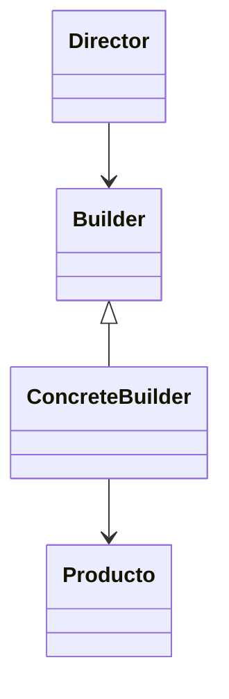

## Casos de uso

* Constructores complejos
* Generación de documentos

## Ventajas

* Construcción flexible
* Código más limpio

## Desventajas

* Más clases

## Patrones relacionados

* Abstract Factory
* Composite

---

# 5. Prototype

## Categoría

Creacional

## Problema que resuelve

Permite clonar objetos existentes.

## Diagrama de clases

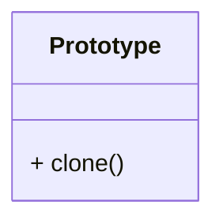

## Casos de uso

* Copias de configuraciones
* Juegos

## Ventajas

* Clonado rápido
* Reduce creación compleja

## Desventajas

* Clonado profundo complejo

## Patrones relacionados

* Factory Method
* Abstract Factory

---

# 6. Adapter

## Categoría

Estructural

## Problema que resuelve

Convierte una interfaz incompatible en otra compatible.

## Diagrama de clases

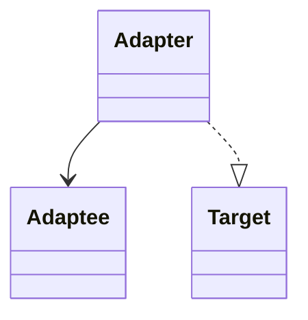

## Casos de uso

* Integración de APIs
* Compatibilidad de sistemas

## Ventajas

* Reutilización de código
* Compatibilidad

## Desventajas

* Complejidad adicional

## Patrones relacionados

* Bridge
* Decorator

---

# 7. Bridge

## Categoría

Estructural

## Problema que resuelve

Separa abstracción de implementación.

## Diagrama de clases

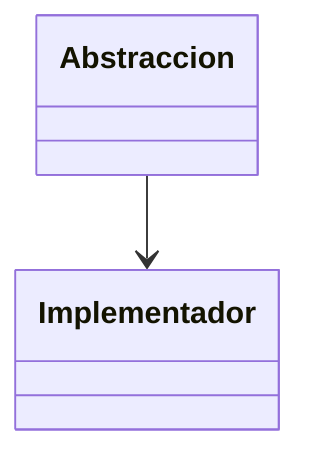

## Casos de uso

* Motores gráficos
* Interfaces multiplataforma

## Ventajas

* Independencia
* Escalabilidad

## Desventajas

* Mayor complejidad

## Patrones relacionados

* Adapter
* Strategy

---

# 8. Composite

## Categoría

Estructural

## Problema que resuelve

Permite tratar objetos individuales y grupos de manera uniforme.

## Diagrama de clases

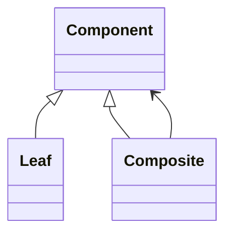

## Casos de uso

* Árboles
* Menús
* Sistemas de archivos

## Ventajas

* Flexibilidad
* Estructuras jerárquicas

## Desventajas

* Diseño complejo

## Patrones relacionados

* Decorator
* Iterator

---

# 9. Decorator

## Categoría

Estructural

## Problema que resuelve

Agrega funcionalidades dinámicamente.

## Diagrama de clases

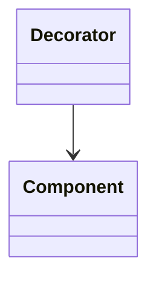

## Casos de uso

* Streams
* Interfaces gráficas

## Ventajas

* Flexible
* Extensible

## Desventajas

* Muchas clases pequeñas

## Patrones relacionados

* Composite
* Adapter

---

# 10. Facade

## Categoría

Estructural

## Problema que resuelve

Proporciona una interfaz simplificada.

## Diagrama de clases

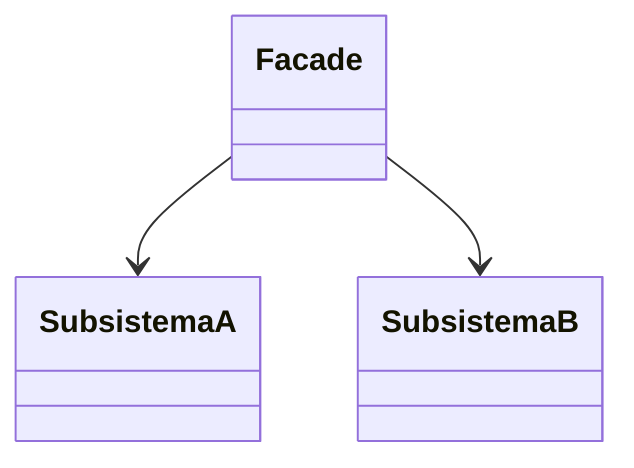

## Casos de uso

* APIs complejas
* Frameworks

## Ventajas

* Simplificación
* Bajo acoplamiento

## Desventajas

* Puede convertirse en objeto gigante

## Patrones relacionados

* Singleton
* Mediator

---

# 11. Flyweight

## Categoría

Estructural

## Problema que resuelve

Reduce uso de memoria compartiendo objetos.

## Diagrama de clases

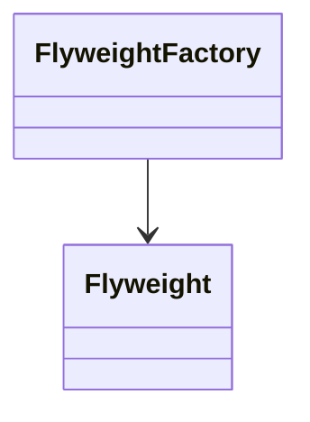

## Casos de uso

* Juegos
* Editores de texto

## Ventajas

* Optimización de memoria

## Desventajas

* Complejidad

## Patrones relacionados

* Singleton
* Composite

---

# 12. Proxy

## Categoría

Estructural

## Problema que resuelve

Controla el acceso a otro objeto.

## Diagrama de clases

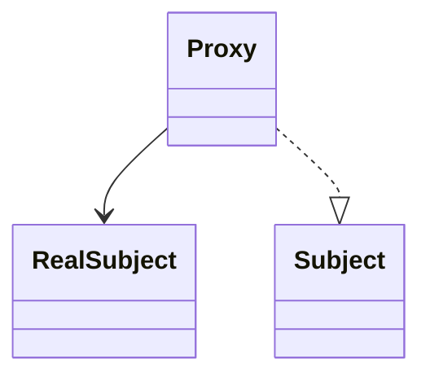

## Casos de uso

* Seguridad
* Caché
* Lazy loading

## Ventajas

* Control de acceso

## Desventajas

* Mayor complejidad

## Patrones relacionados

* Decorator
* Adapter

---

# 13. Chain of Responsibility

## Categoría

Comportamiento

## Problema que resuelve

Permite pasar solicitudes por una cadena de objetos.

## Casos de uso

* Middleware
* Validaciones

## Ventajas

* Bajo acoplamiento

## Desventajas

* Difícil seguimiento

## Patrones relacionados

* Command
* Mediator

---

# 14. Command

## Categoría

Comportamiento

## Problema que resuelve

Encapsula solicitudes como objetos.

## Casos de uso

* Undo/Redo
* Menús

## Ventajas

* Desacoplamiento

## Desventajas

* Muchas clases

## Patrones relacionados

* Strategy
* Chain of Responsibility

---

# 15. Interpreter

## Categoría

Comportamiento

## Problema que resuelve

Define representación gramatical.

## Casos de uso

* Lenguajes
* Compiladores

## Ventajas

* Flexible

## Desventajas

* Complejo para gramáticas grandes

## Patrones relacionados

* Visitor
* Composite

---

# 16. Iterator

## Categoría

Comportamiento

## Problema que resuelve

Permite recorrer colecciones.

## Casos de uso

* Listas
* Árboles

## Ventajas

* Recorrido uniforme

## Desventajas

* Sobrecarga adicional

## Patrones relacionados

* Composite
* Memento

---

# 17. Mediator

## Categoría

Comportamiento

## Problema que resuelve

Centraliza comunicación entre objetos.

## Casos de uso

* Chats
* Interfaces GUI

## Ventajas

* Reduce acoplamiento

## Desventajas

* Mediador complejo

## Patrones relacionados

* Facade
* Observer

---

# 18. Memento

## Categoría

Comportamiento

## Problema que resuelve

Guarda y restaura estados.

## Casos de uso

* Undo/Redo
* Juegos

## Ventajas

* Recuperación de estado

## Desventajas

* Uso de memoria

## Patrones relacionados

* Command
* Iterator

---

# 19. Observer

## Categoría

Comportamiento

## Problema que resuelve

Notifica cambios automáticamente.

## Casos de uso

* Eventos
* Suscripciones

## Ventajas

* Comunicación desacoplada

## Desventajas

* Difícil depuración

## Patrones relacionados

* Mediator
* Singleton

---

# 20. State

## Categoría

Comportamiento

## Problema que resuelve

Cambia comportamiento según estado.

## Casos de uso

* Máquinas de estado
* Flujos de trabajo

## Ventajas

* Código organizado

## Desventajas

* Muchas clases

## Patrones relacionados

* Strategy
* Singleton

---

# 21. Strategy

## Categoría

Comportamiento

## Problema que resuelve

Permite cambiar algoritmos dinámicamente.

## Casos de uso

* Métodos de pago
* Ordenamiento

## Ventajas

* Flexibilidad

## Desventajas

* Muchas estrategias

## Patrones relacionados

* State
* Template Method

---

# 22. Template Method

## Categoría

Comportamiento

## Problema que resuelve

Define estructura de algoritmo.

## Casos de uso

* Frameworks
* Librerías

## Ventajas

* Reutilización

## Desventajas

* Herencia rígida

## Patrones relacionados

* Strategy
* Factory Method

---

# 23. Visitor

## Categoría

Comportamiento

## Problema que resuelve

Permite agregar operaciones sin modificar clases.

## Casos de uso

* Compiladores
* AST

## Ventajas

* Extensible

## Desventajas

* Complejo

## Patrones relacionados

* Interpreter
* Composite

---

# Conclusiones

Los patrones GoF representan buenas prácticas de diseño orientado a objetos y permiten desarrollar software más mantenible, reutilizable y escalable.

---

# Referencias

* Gamma, E., Helm, R., Johnson, R., & Vlissides, J. Design Patterns.
* Refactoring Guru.
* SourceMaking.
